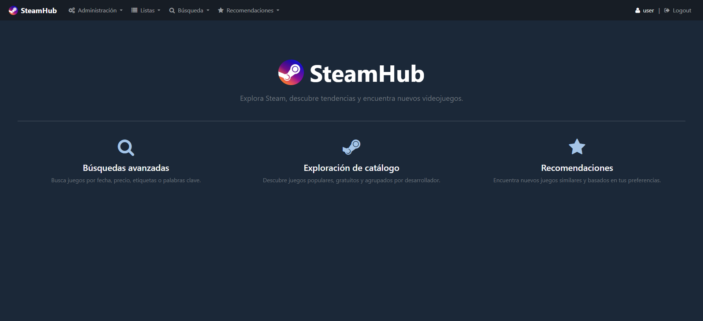
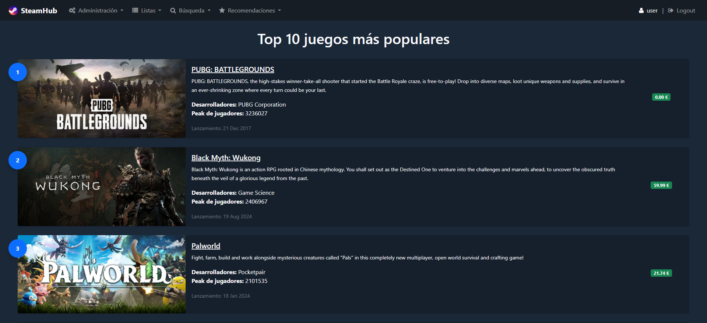
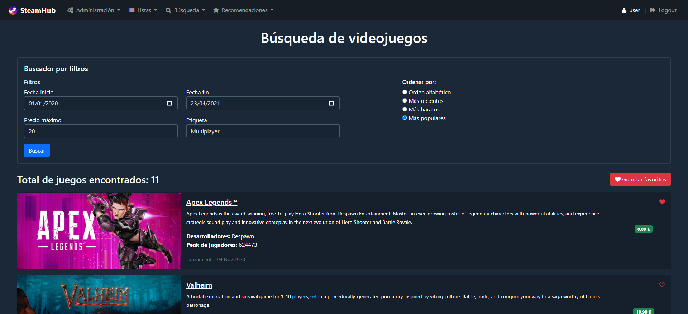
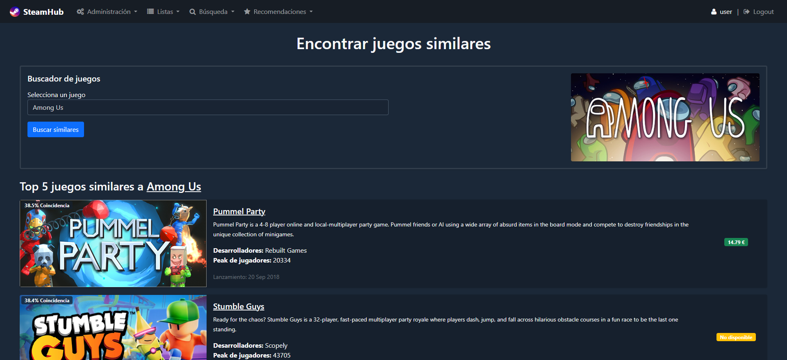

# SteamHub

SteamHub is a Django web application that allows users to explore a catalogue of Steam games through advanced search tools, curated listings and a content-based recommendation system. The platform automatically collects game information from Steam-related websites, indexes textual content for efficient retrieval, and generates personalized recommendations based on user preferences.

## Features

* **Steam Data Collection**: Automated scraping of game information using BeautifulSoup.
* **Game Catalogue**: Browse games with detailed information including descriptions, developers, tags, prices and player statistics.
* **Advanced Filtering**: Search games by release date, maximum price and tags.
* **Full-Text Search**: Keyword-based search powered by Whoosh across titles, descriptions, extended information and reviews.
* **User Favourites**: Save and manage favourite games using Django's authentication system.
* **Content-Based Recommendations**: Personalized recommendations based on game tags and textual similarity.
* **Similar Game Discovery**: Find games similar to a selected title.

## Interface Preview

<table>
  <tr>
    <td align="center" width="50%">
      <b>Home</b>
      
    </td>
    <td align="center" width="50%">
      <b>Most Popular Games</b>
      
    </td>
  </tr>
  <tr>
    <td align="center" width="50%">
      <b>Filter Search</b>
      
    </td>
    <td align="center" width="50%">
      <b>Recommendations</b>
      
    </td>
  </tr>
</table>

## Installation

1. Clone this repository:

```bash
git clone https://github.com/ivrugue/steam-recommender-system.git
cd steamhub
```

2. Install dependencies:

```bash
pip install django beautifulsoup4 whoosh
```

3. Apply database migrations:

```bash
python manage.py migrate
```

4. Create an administrator account:

```bash
python manage.py createsuperuser
```

5. Run the development server:

```bash
python manage.py runserver
```

6. Access the application at http://127.0.0.1:8000

7. Sign in with the administrator account and access the administration pages to:
    * Populate the database.
    * Load the recommendation system.

## Data Collection

The application gathers information from multiple Steam-related sources.

* **SteamCharts**: Used to retrieve most popular Steam games and historical Peak player counts

* **Steam Store**: Used to retrieve Title, Description, About section, Release date, Price, Developers, Tags and Images

* **Steam Community**: Used to retrieve user reviews

Collected information is stored both in Django models and in a Whoosh index for efficient text search.

## Recommendation System

SteamHub implements a hybrid content-based recommendation system based on two independent similarity measures.

### Tag Similarity

Games are compared according to their tags using the Dice coefficient. For user recommendations, tag relevance is weighted according to how frequently each tag appears among the user's favourite games.

### Textual Similarity

Descriptions and "About" sections are indexed using Whoosh. Text similarity scores are obtained by querying game descriptions against the indexed content of all other games.

### Final Recommendation Score

The final similarity score combines both approaches:

* 70% tag similarity
* 30% textual similarity

## Main Functionalities

### Curated Lists

* Favourite games
* Top 10 most popular games by historical peak player count
* Developers with free games

### Search

* Filter-Based Search

    * Allows filtering by Minimum release date, Maximum release date, Maximum price and Tag

    * Results can be sorted by Title, Release date, Price or Popularity

* Keyword Search

    * Allows searching across Title, Description, About section and Reviews

    * Supports both OR queries and AND queries

* Logged-in users can manage their favourite games directly from the results of both search tools.

### Recommendations

* Personalized Recommendations: Returns the 10 most relevant games for a user based on their favourite games.

* Similar Games: Returns the 5 most similar games to a selected title.

## Technologies

| Component             | Technology               |
| :-------------------- | :----------------------- |
| Backend               | Django                   |
| Database              | SQLite                   |
| Web Scraping          | BeautifulSoup            |
| Full-Text Search      | Whoosh                   |
| Recommendation Engine | Dice Similarity + Whoosh |
| Authentication        | Django Auth              |
| Frontend              | Django Templates         |

